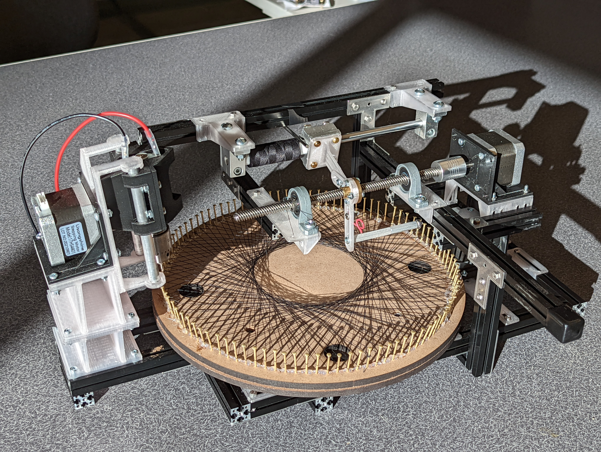
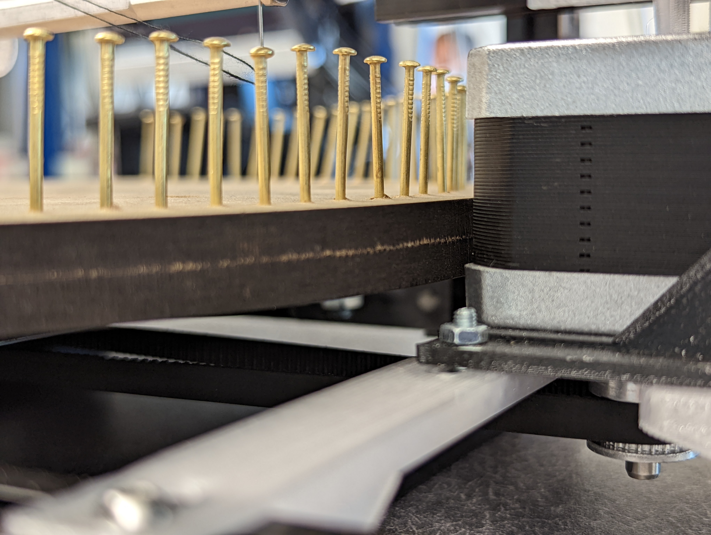
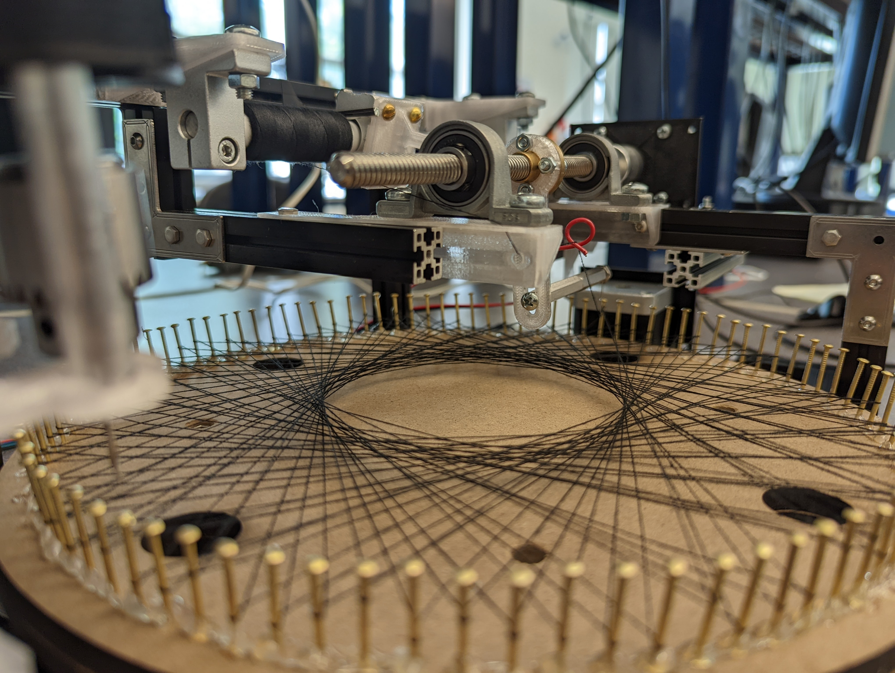

<!---











-->


<p align="center">
  
</p>

<div align="center">
  <h1>String Art Machine</h1>
  <p><strong>By:</strong> Ahkar Kyaw, Elvis Tang</p>
</div>

In tutorial we will learn how to build a machine that can replicate an image using strings. We built this machine for our ME405 class. It is still a work in progress with many rooms for improvement but we are very pleased with how far it has come and we are excited to share the project with you. 

# Introduction
String art, often referred to as pin-and-thread art, refers to a form of art that weaves colored string, wool, wire, or yarn between hammered nails to make geometric patterns. String art is not new and its origins go all the way back to the 19th century. It started off as an educational tool to introduce mathematical ideas to children but came back in the late 1960s as a decorative craft in a form of books and kits. 

Inspired by the beauty and complexity of this art style, we decided to build a machine that can replicate any image using lines and recreate it physically in a form of string art. This was a very challenging project and due to time constraint, we were unable to perfect it to our desired standard. However, it works and we are thrilled to share our project with you. Hopefully you will find ways to improve our project further. 


|  | |
| ---------------- | --------------- |

# Product Specification
## Hardware Components
| **Components** | **vender**     | **Dimension** |
| :-----------:  | :-----------: | :-----------: |
| MDF board | [Amazon](https://www.amazon.com/dp/B07QWSTMWJ?ref_=cm_sw_r_cp_ud_dp_WGG48NSVNE196GH4DMZJ) | 14-in(L) x 11-in(W) x 0.25-in(T)|
| Nails | [Amazon](https://www.amazon.com/Projects-Antique-Repairing-Decorative-Accessories/dp/B082J2JXZD?tag=cf09c0-20&geniuslink=true&th=1) | 23mm(L) |
| String | [Amazon](https://www.amazon.com/dp/B07LC1YDVR?ref_=cm_sw_r_cp_ud_dp_Z0H458M8TY3VP6MC05YG) | 200m |
| 80/20 Aluminum Extrusion | [McMASTER-CARR](https://www.mcmaster.com/80//t-slotted-framing-rails/) | 20mm x 20mm |
| T8 Lead Screw Nut Set | [Amazon](https://www.amazon.com/dp/B07GV72326?ref_=cm_sw_r_cp_ud_dp_XBR2BX6C1A7YK6SPVKN0) | 200mm(L), 8mm(D) |


## Electronic Components
| **Components** | **Vender** | **Datasheet**  |
| :-----------:  | :-----------: | :----------- |
| NUCLEO (STM32L476RG) | [MOUSER](https://www.mouser.com/ProductDetail/STMicroelectronics/NUCLEO-L476RG?qs=PRtH0mD6DWbM6mRV5DKjBQ%3D%3D) | https://www.st.com/resource/en/datasheet/stm32l476rg.pdf |
| Shoe of Brian | [OSHPARK](https://oshpark.com/shared_projects/e6X6OnYK) |  http://wind.calpoly.edu/ME405/doc/shoe_info.html |
| Mini Hand Drill DC Motor | [Amazon](https://www.amazon.com/AUTOTOOLHOME-Electric-Drill-Motor-Drills/dp/B01LZYWFE4/ref=asc_df_B01LZYWFE4/?tag=hyprod-20&linkCode=df0&hvadid=309735728871&hvpos=&hvnetw=g&hvrand=12073945360090893366&hvpone=&hvptwo=&hvqmt=&hvdev=c&hvdvcmdl=&hvlocint=&hvlocphy=1014232&hvtargid=pla-461591041401&psc=1)| https://www.sears.com/autotoolhome-mini-dc-12v-electric-hand-drill-motor/p-A098205228 |
| NEMA 17 Stepper Motor | [Amazon](https://www.amazon.com/dp/B07QV1ZVJR?tag=rpantiques-20&linkCode=ogi&th=1) | http://www.autoflexible.com/file_upload/product/attach/NEMA%2017.pdf |
| LCD 1602 (I2C port) | [Amazon](https://www.amazon.com/dp/B019K5X53O?ref_=cm_sw_r_cp_ud_dp_NDRGXARM7KG02A7N59Y2) | http://www.handsontec.com/dataspecs/module/I2C_1602_LCD.pdf |
| TMC4210 | [MOUSER](https://www.mouser.com/ProductDetail/Trinamic/TMC4210-I?qs=TiOZkKH1s2TH5TqjeGBn1g%3D%3D) | https://www.trinamic.com/fileadmin/assets/Products/ICs_Documents/TMC4210_Datasheet_Rev.1.06.pdf |
| TMC2208 | [Amazon](https://www.amazon.com/Printer-TMC2208-Screwdriver-Controller-Ramps1-4/dp/B082LSQWZF/ref=sr_1_3?keywords=tmc2208&qid=1654876252&sr=8-3) | https://www.trinamic.com/fileadmin/assets/Products/ICs_Documents/TMC220x_TMC2224_datasheet_Rev1.09.pdf |


## Manufacturing / Machining Tools
| **Tool** | Source Files |
| :-----------:  | :-----------:  |
| 3D Printer | [ME405_StringArt/CAD Files/3D Printing/](https://github.com/AhKyaw/ME405_StringArt/tree/main/CAD%20Files/3D%20Printing) |
| Laser Cutter | [ME405_StringArt/CAD Files/Laser Cutting/](https://github.com/AhKyaw/ME405_StringArt/tree/main/CAD%20Files/Laser%20Cutting)  |

# System Design
## System Operating Procedure

<div align="center">
  
</div>


## Mechanical Design
To begin with, let’s take a look at the mechanical components of this machine. The overall frame this machine is made entirely out of 80/20 aluminum extrusion. The machines moves using 3 stepper motors and a DC motor with a drill attached to the tip. These motors are then mounted onto the frame using custom 3D printed parts. CAD files for these 3D printed parts can be found under Manufacturing - 3D Printer Source files. 

For the drawing board, we used a laser cut MDF board. The DXF file for laser cutting can be found under Manufacturing - Laser Cutter Source files. Once the board is cut, attach it onto the 3D printed braket #4 and the lazy susan, which will be attached to the machine's frame. You can either directly use this board as your art canvas or mount another MDF board onto this existing platform using the pre-cut alignmnet holes. 

The full CAD model to assist you with the assembly of the whole machine can be found in the CAD folder under our GitHub, ME405_StringArt Repository. 

<div align="center">
  
</div>

## Software
### String Art Generator
This is heavily based on the work of reddit user /u/kmmeerts from his post: https://www.reddit.com/r/DIY/comments/au0ilz/made_a_string_art_portrait_out_of_a_continuous_2/
[StringArt_Gen.py](https://gist.github.com/kaspermeerts/781f0137b361b51224dcab722ae387b4)
[String Art: Towards Computational Fabrication of String Images](https://www.dmg.tuwien.ac.at/geom/ig/publications/stringart/stringart.pdf)

|  |  |
| ----------------- |:----------------:|
| left foo          | right foo        |

## Firmware 
### Finite State Machine
text text text

## Motor Control
text text text

# Results Demonstration
## Drilling


## Nailing

## Looping
### Without Interference


### Mechanism


# Challenges
### Inconsistent Nail Height:<br>

|  | The first problem we encountered was the height inconsistency among the nails that we purchased. Even though we managed to drill all the holes to be exactly the same depth, the point of contact between each nail and the looping needle is different. Therefore, the string occasionally slip over the top if the nail is too short compared to others. To fix this problem, you need an alternative string feeding mechanism where the string is fed directly from the top instead of the side like what we have. This way, you the needle can loop the strings along a much lower plane without having to worry about the string getting tangled up. |
| ----------------- |:----------------|


### String Getting Tangled Up:<br>
|  | The Second problem we encountered was with regards to the string getting tangled up after looping around the nail. There are two main reasons for why this happen. First is due to the lack of tension in the string. This lack of retraction causes the string to droop down after it  |
| ----------------- |:----------------:|


### Insufficient Nail Depth:<br>
text text text<br>


### With Interference 


# Reference

# Hardware
Text

# Software
Text

# Challenges
Text


## Program

```
let message = 'Hello world';
alert(message);
```

# Markdown Reference

# This is a Heading h1
## This is a Heading h2 
###### This is a Heading h6

*This text will be italic*  
_This will also be italic_

**This text will be bold**  
__This will also be bold__

_You **can** combine them_

* Item 1
* Item 2
* Item 2a
* Item 2b

1. Item 1
1. Item 2
1. Item 3
  1. Item 3a
  1. Item 3b

## Images


https://drive.google.com/file/d/1LtbPpOibTKHI9eM-5CNW1QeBWgA9KlBs/view?usp=sharing

## Links

You may be using [Markdown Live Preview](https://markdownlivepreview.com/).


## Blockquotes

> Markdown is a lightweight markup language with plain-text-formatting syntax, created in 2004 by John Gruber with Aaron Swartz.
>
>> Markdown is often used to format readme files, for writing messages in online discussion forums, and to create rich text using a plain text editor.
## Inline code

This web site is using `markedjs/marked`.
